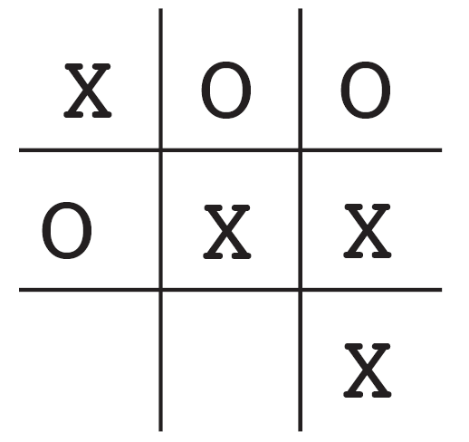
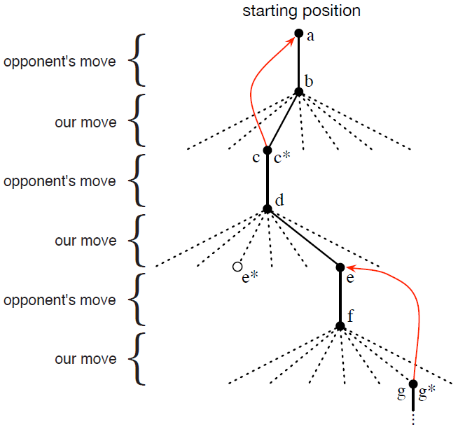

# 1.5 一个拓展实例: 井字棋

<link href="../../css/style.css" rel="stylesheet"></link>
为了更好地阐明强化学习的一般概念并将其与其他方法作对比, 我们接下来考虑更详尽地考虑一个实例.

回想一下熟悉的儿童游戏——井字棋&lt;tic-tac-toc&gt;. 两个玩家轮流在3$$\times$$3的棋盘上下棋. 两个玩家轮流下X与O, 直到一个玩家在水平方向上、垂直方向上或对角线方向上放置了一排的三枚棋子以赢得游戏, 如图中X所做的那样. 如果棋盘填满了而没有任何一名玩家放置出一排三枚棋子, 那么该局比赛就是平局. 因为一名有经验的玩家永远不会输, 让我们假设我们在和一名下棋不完美的玩家对抗, 他有时会下错来让我们赢. 让我们暂时假设平局和输掉比赛一样糟糕. 我们该怎样构建一个能发现对手的缺陷并最大化获胜概率的下棋程序呢?

虽然这是一个简单的问题, 但不能使用原有的技术来便利地、令人满意地解决. 例如, 博弈论中的典型的"极小化极大"&lt;minimax&gt;方法在这里是不适用的, 因为其假设了对手下棋的方式. 例如, 一个极小化极大程序永远不会到达一个可能会将其引向失败的状态, 即使在多数情况下因为对手的失误该状态会引向胜利. 典型的针对一系列决策问题的优化方法, 例如动态规划&lt;dynamic programming&gt;, 可以*计算*出针对任一对手的方案, 但需要对手完整的详细说明——包括在棋盘的每一个状态中对手下任意一步棋的概率——作为输入. 让我们假设这些信息并非先验的, 正如实际关注上的多数问题. 另一方面, 通过和同一个对手下多盘棋, 这样的信息可以从经验中被评估出来. 对经典方法而言, 关于此问题能做到的最好的就是先学习得到有一定置信度的对手行为模型,  然后对给定的对手近似模型应用动态规划来计算最优解. 最后的这种方法, 和我们之后在本书中探讨的一些强化学习方法没有太大差别.

如果在本问题上应用进化方法, 那么其将在直接在策略空间中搜索可以以高概率战胜对手的策略. 其中, 一个策略即为指导玩家在每一个游戏状态——每一个在3$$\times$$3的棋盘上合法的X与O的配置——中该怎么走的规则. 对于每一个考虑的策略, 其获胜概率的估计值可以通过与对手下多盘棋来获得. 这样的估计将用于指导哪些策略能够之后继续被考虑. 一个典型的进化算法能在策略空间中逐步提升&lt;hill-climb&gt;, 不停产生并估计策略以获得增量式的改进. 或者, 维持并估计多个策略的遗传算法也可以被使用. 事实上数以百计的优化算法都可以被使用.

接来下讨论井字棋问题怎么利用值函数来处理. 首先我们为每一个可能的状态建立一张数值表. 每一个数值都是从该状态起获胜的概率的最新估计值. 我们将此作为每一个状态的*值*&lt;value&gt;, 同时整张表就是学得的值函数. 如果当前从状态A开始获胜的估计值比状态B高, 那么状态A的值比状态B高, 或者说状态A比状态B更"好". 假设我们一直执X, 那么对所有有一排三枚X棋子的状态其获胜概率为1, 因为我们已经赢了. 类似的, 对于所有有一排三枚O棋子的状态或平局, 其获胜概率为0, 因为我们已经不可能赢了. 我们将所有其他状态的初始值设为0.5, 表示我们猜测对于这些状态有50%的概率获胜.

然后我们同对手玩许多盘棋. 为了选择下一步棋, 我们检查所有可能的下一步棋之后对应的状态(当前棋盘上任一空填上后各自对应一个状态), 然后在表中查找各个状态当前的估计值. 在多数情况下我们*贪心*&lt;greedy&gt;地选择下一步棋, 即选择对应着值最高的状态的那步棋, 选择胜率估计值最高那步棋. 然而, 我们偶尔随机地选择下一步棋. 这些棋被称为*探索*&lt;exploratory&gt;步, 因为这让我们探索反之根本无法经历的状态. 游戏中一系列考虑与下的棋被绘制在了[图1.1](to figure1.1)中.

<b>图1.1</b>
一系列的井字棋下法. 实现表示游戏中实际所下; 虚线表示我们(我们的强化学习程序)考虑了, 但没有实际采用的下法. 我们下的第二步棋是一个探索步, 这意味着另一个同胞节点, 即那个$$\mathrm e^*$$对应的结点, 估计值更高. 探索步并不能造成学习; 但所有其他的步数可以, 这形成了如图中红色箭头所示的更新, 其中估计值从树的子孙结点流向祖先结点, 细节在正文中叙述.

当我们在下棋时, 我们更改我们经历过的状态的值. 我们尝试做出对获胜率更为准确的估计. 为了做到这一点, 我们将做出贪心选择后的状态值*回溯*&lt;back up&gt;至做出贪心选择前的状态, 如[图1.1](to figure1.1)所示. 更确切地说, 早先状态的当前值更新后向后续状态的值靠拢. 这可以通过将早先状态的值向后续状态靠拢一部分做到. 让我们用$$S_t$$标识做出贪心选择前的状态, 用$$S_{t + 1}$$标识贪心选择后的状态, 那么对$$S_t$$的值的估计——记作$$V(S_t)$$——的更新可以写作:

$$V(S_t) \leftarrow V(S_t) + \alpha[V(S_{t + 1}) - V(S_t)]$$,

其中$$\alpha$$为称为*步长*&lt;step-size&gt;的参数, 为一个小的正数, 能影响学习的速率. 上述的更新是*时序差分*&lt;temporal difference, TD&gt;学习方法的特例, 时序差分名称的由来为更新是基于$$V(S_{t + 1}) - V(S_t)$$这一两个连续状态的估计值之差.

上述的方法在这个问题上表现很好. 例如, 如果步长参数能随时间以合适的速率递减, 那么对于任何给定的对手, 任意状态的估计值都能收敛到从该状态开始我方使用最优策略的话最终获胜的概率. 更进一步说, 收敛后所下的每一步(除去探索步)事实上都是针对这一(非完美)对手的最优下法. 换句话说, 此方法最终收敛为针对这一对手的最优策略. 如果步长参数没有随时间减小到0, 那么下棋程序也能很好地应对缓慢地改变策略的玩家.

这一例子阐明了进化方法与使用值函数的方法的区别. 为了评估一个策略, 进化方法使该策略固定, 同对手下许多盘棋或使用对手的模型模拟下许多盘棋. 获胜的频率给出了该策略获胜概率的无偏估计, 该频率可以用于指导下一步的策略选择. 但策略改进必须要经过许多盘游戏, 并且只有每局游戏的最终结果被利用了: 发生在游戏*过程中*的一切都被忽视了. 例如, 如果程序获胜了, 那么这局游戏中的*所有*行为都获得了赞誉&lt;credit&gt;, 无论某一步对获胜而言有多重要. 赞誉甚至被给予从未下过的那几步. 而使用值函数的方法, 与之相反, 允许对各个状态分开进行评估. 从结果上而言, 进化方法与值函数方法都搜索了策略空间, 但学得值函数利用了游戏过程中的信息.

这个简单的例子阐明了强化学习方法的一些关键特征. 首先, 在有对手的情况下, 必须强调从与环境的交互中学习. 其次, 必须要有明确的目标, 且正确的动作选择需要将延迟的效果考虑在内的计划或远见. 例如, 简单的强化学习程序可能会学会由多步组成的陷阱, 来应对短视的对手. 这是强化学习方法的一个显著特征: 其不需要对手的模型, 也不需要对未来可能的动作、状态序列进行显式搜索, 就可以达到计划与预见的目的.

虽然这个实例阐明了一些强化学习的基本特征, 但它是在是太简单了, 以致于可能会给人留下强化学习的应用十分有限的印象. 除了井字棋这样的双人游戏外, 强化学习也可以用于没有形式上的对手的情形, 即"与自然斗争的游戏". 虽然井字棋游戏中每一局是分开的且只在每一局的末尾有奖赏, 但强化学习并不局限于将交互划分为不同篇章&lt;episode&gt;的问题. 强化学习也可以应用于交互无穷无尽的情况, 或可以在任意时间接受不同量级的奖赏的情况. 强化学习甚至可以应用于不像井字棋那样将时间分为离散的步长的问题. 强化学习的一般准则也适用于连续时间段&lt;continuous-time&gt;问题, 但相关理论同时也变得更复杂, 因此在本导论性质的书中略去.

虽然井字棋问题的状态集有限且元素数目较小, 但即使状态集很大乃至无限, 强化学习方法也依然适用. 例如, Gerry Tesauro(1992, 1995)将上述算法同人工神经网络结合起来, 并用于有大约$${10}^{20}$$个状态的西洋双陆棋&lt;backgammon&gt;游戏. 对于这么多状态而言, 即使只经历其中的一小部分也是不可能的. Tesauro的程序的表现远比之前的任何程序好, 并最终超过了顶级人类玩家([第16.1节](to section16.1)). 人工神经网络为程序提供了从过去经验进行泛化的能力, 所以当面临新状态时, 程序能通过人工神经网络, 来根据过去面临的类似状态选择合适的下法. 在面临拥有如此庞大的状态集的问题时, 强化学习系统的性能同其能在多大程度上对过去的经验进行泛化密切相关. 在这个主题上, 强化学习最需要监督学习的方法. 人工神经网络与深度学习([第9.6节](to section9.6))既不是唯一的方法, 也不一定是最好的方法.

井字棋游戏中, 在学习开始时没有除游戏规则外的任何先验知识, 但强化学习并不一定要从空白开始. 恰恰相反, 先验知识可以以多种方式集成到强化学习中, 且有时这对高效的学习而言是必需的(例如, 参见[第9.5节](to section9.5)、[第17.4节](to section17.4)及[第13.1节](to section13.1)). 此外, 在井字棋游戏中我们可以获取到真实的状态信息, 但强化学习也可以应用于部分状态被隐藏的情形, 或者对学习器而言不同的状态看上去相同的情形.

最后, 预见未来并预测其所有可能的下法所引出的状态对强化学习程序来说是可能的. 但是为了做到这一点, 强化学习程序需要一个游戏的模型, 该模型能预测环境对程序尚未走的那一步的可能反应. 许多问题都类似, 但在有些问题中甚至关于短期的动作效果的模型也无法得到. 强化学习在两种情况下都可以适用. 模型并不是必须的, 但如果有现成的模型或模型可以学得, 那么这些模型可以轻而易举地被使用([第8章](to chapter8)).

在另一方面, 存在着不需要任何环境模型的强化学习方法. 免模型系统甚至无法预测环境对单个动作的反应.  使用TD方法的井字棋程序从对手的意义上说是免模型的: 其没有任何种类的关于对手的模型. 因为模型必须要足够准确才能派得上用场, 所以当解决问题的瓶颈在于难以构建足够准确的环境模型时, 免模型方法比其他更复杂的方法有优势. 免模型方法也是有模型方法的重要组件. 本书中, 我们先用数章讨论免模型方法, 然后再讨论其怎样作为更为复杂的有模型方法的组件.

强化学习方法即可以用于系统中的高层, 也可以用于系统中的底层. 虽然在井字棋程序仅学会了游戏的下法, 但没有什么能阻碍将强化学习用于更高的层次中, 其中可能每一个"动作"本身就是复杂的应用. 在层次化学习系统中, 强化学习可以同时工作于多个层级.

*练习 1.1: 左右互搏*&nbsp; &nbsp; &nbsp; &nbsp; 假设如果强化学习算法并非与随机的对手对战, 而是左右互搏并且两边都进行学习. 你认为这种情况下会发生什么? 其能够学得不同的策略吗?$$\square$$

*练习 1.2: 对称性*&nbsp; &nbsp; &nbsp; &nbsp; 许多井字棋的走法看上去不一样, 但因为对称性的关系本质上是相同的. 我们该怎样修改上述的学习过程来利用这一点? 这一改变会以怎样的形式改善学习过程? 现在, 再思考另一个问题. 如果对手没有利用对称性. 那么在这种情况下, 我们应该利用对称性吗? 对称的位置一定有相等的值吗?$$\square$$

*练习 1.3: 贪心的下法*&nbsp; &nbsp; &nbsp; &nbsp; 假设强化学习程序是贪心的, 即其永远选择能带来最高值的下法. 那么其学得的策略会比非贪心程序更好还是更差? 什么样的问题可能会出现?$$\square$$

*练习 1.4: 从探索中学习*&nbsp; &nbsp; &nbsp; &nbsp; 假设在所有游戏中的所有步之后都进行更新, 包括探索步. 如果步长参数随时间流逝逐渐适当地减小(但探索的可能性不会), 那么各个状态的值会收敛至一个不同的胜率的集合. 从概念上说, 当从或者不从探索步中学习时, 这两个胜率的集合各自是什么? 加谁我们继续做出探索步, 那么哪一个胜率的集合可能会更好? 哪一个可能会赢得更多?$$\square$$

*练习 1.5: 其他改进*&nbsp; &nbsp; &nbsp; &nbsp; 你可以想到其他改善强化学习程序的方式吗? 你可以想到更好的用于解决上述的井字棋问题的方法吗?$$\square$$