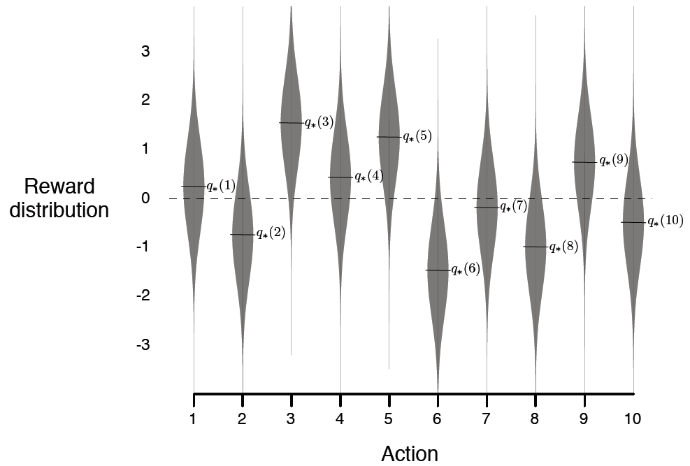
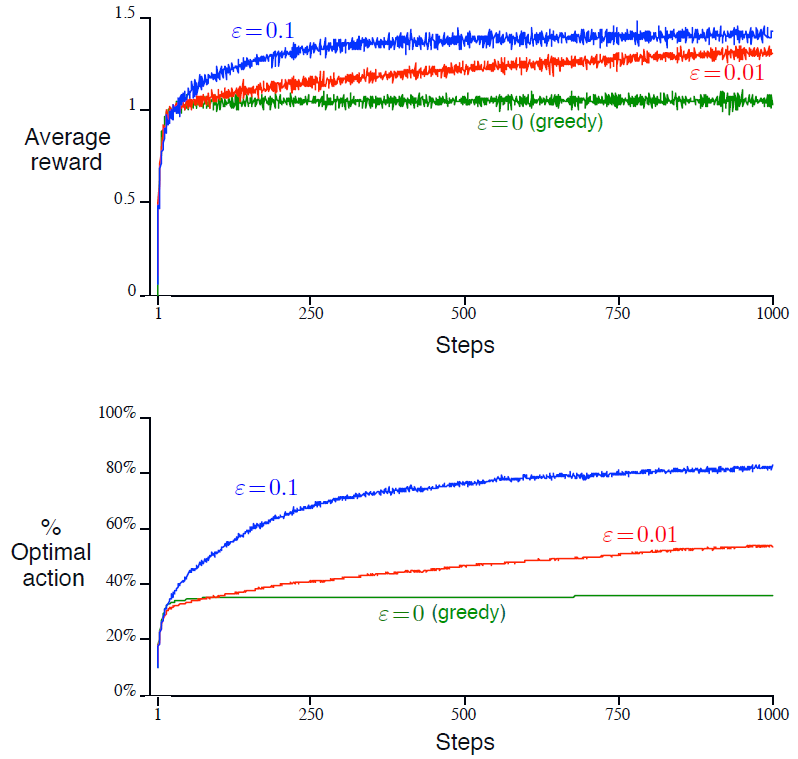

# 2.3 10-摇臂测试工具

<link href="../../../css/style.css" rel="stylesheet"></link>
为了大致地评估贪心与$$\varepsilon​$$-贪心动作值方法的相对效率, 我们使用一个测试问题套件来定量地比较它们. 这是一个由2000个随机生成的$$k​$$-摇臂赌博机问题组成的集合, 其中$$k = 10​$$. 对每个赌博机问题而言, 如在[图2.1](to figure2.1)中所展示的, 各个动作值$$q_*(a), \; a= 1, \dots, 10​$$, 是从均值为0且方差为1的正态(高斯)分布中采样得到的. 并且, 若一个应用于本问题的学习方法在时步$$t​$$时选择了动作$$A_t​$$, 那么实际奖赏$$R_t​$$是从均值为$$q_*(A_t)​$$且方差为1的正态分布中采样获得的. 这些分布在[图2.1](to figure2.1)中用灰色表示. 我们将这个测试任务套件称为*10-摇臂测试工具*. 对于任何学习方法来说, 当将其应用于赌博机问题之一时, 我们可以在1000多个时步中测量其逐步改进的性能与表现. 这构成了一个*行程*&lt;run&gt;. 将此重复2000个独立的行程, 且每个行程使用不同的赌博机问题, 我们获得了对学习算法的平均表现的度量.

<b>图2.1</b>
一个来自10-摇臂测试工具的赌博机问题示例. 10个动作的真实值$$q_*(a)$$是从均值为0且方差为1的正态分布中采样得到的, 并且实际奖赏是从均值为$$q_*(a)$$且方差为1的正态分布中采样得到的.

使用如上所述的10-摇臂测试工具, 对贪心方法以及两个$$\varepsilon$$-贪心方法($$\varepsilon = 0.01$$及$$\varepsilon = 0.1$$)进行对比, 结果如[图2.2](to figure2.2)所示. 所有方法都使用采样平均方法来估计动作值. 上方的图展示了随经历增长的期望奖赏. 在最开始, 贪心方法比余下方法增长得稍微快一点, 但在一个很低的水平就趋于平稳了. 其只达到了单步奖赏约为1的水准, 而在此测试工具上单步奖赏可能的最大值约为1.55. 贪心方法在长期中过程中表现明显相对其他方法更差, 因为其常常陷于对次优动作的选择中. 下方的图显示贪心方法在大约三分之一的任务中找到了最优动作. 在余下的三分之二任务中, 其对最优动作的初始采样值偏低, 因此最优动作从未再次被选择. $$\varepsilon$$-贪心方法最终表现得比贪心方法更好, 因为前者持续探索与持续提高发现最优动作的可能. $$\varepsilon = 0.1$$的方法探索得更多, 所以常常更早地发现最优动作, 但其从不会以超过91%的概率选择该动作. $$\varepsilon = 0.01$$的方法提升得更为缓慢, 但最终会在图中的两种测度上比$$\varepsilon = 0.1$$的方法表现得更好. 也可以随时间逐步减小$$\varepsilon$$来吸收高$$\varepsilon$$与低$$\varepsilon$$值的优点.

<b>图2.2</b>
$$\varepsilon$$-贪心动作值方法在10-摇臂测试工具上的平均表现. 这些数据是对超过2000次使用不同赌博机问题的行程中数值的平均. 所有的方法使用采样平均方法估计动作值. 

$$\varepsilon$$-贪心方法对贪心方法的优势视任务而定. 例如, 假设奖赏的方差变得更大, 比如是10而不是1. 对于有更多噪声的奖赏, 需要更多的探索来发现最优动作, 那么$$\varepsilon$$-贪心方法的优势甚至会更大. 在另一方面, 如果奖赏的方差为0, 那么贪心方法在试过一次后就可以得知所有动作的真实值. 在这种情况下贪心方法可能是表现得最好的, 因为其立即发现了最优解, 然后不再做任何探索. 但如果我们弱化一些假设, 即使是在确定性&lt;deterministic, 表示概率为1, 如上述的方差为0的情形, 与下述的非固定性不同&gt;情况下, 探索也能很有优势. 例如, 假设赌博机问题是非固定性&lt;nonstationary&gt;的, 即动作的真实值会随时间变化. 在这种情况下, 即使有确定性的存在, 依然需要探索来保证没有一个非贪心动作变得比贪心动作更好. 就像我们在接下来的几章看到的那样, 非固定性情况在强化学习中最为常见. 即使潜在的任务是确定性与固定性的, 学习器也可能面临一组这样的任务, 而其中每个任务随着学习的进行和代理的决策策略的变化而随时间改变. 强化学习需要对探索与利用的平衡.

*练习 2.2: 赌博机例子*&nbsp; &nbsp; &nbsp; &nbsp;考虑一个$$k = 4$$的$$k$$-摇臂赌博机问题, 其中各个摇臂分别记为1, 2, 3, 4. 将一赌博机算法应用于该问题, 该算法使用$$\varepsilon$$-贪心动作选择与样本平均动作值估计方式, 且对所有的动作$$a$$, 初始估计值$$Q_1(a) = 0$$. 假设最开始的动作与奖赏序列为$$A_1 = 1$$, $$R_1 = 1$$, $$A_2 = 2$$, $$R_2 = 1$$, $$A_3 = 2$$, $$R_3 = 2$$, $$A_4 = 2$$, $$R_4 = 2$$, $$A_5 = 3$$, $$R_5 = 0$$. 其中有些时步$$\varepsilon$$情况发生了, 使得一个动作被随机选择. 在哪些时步中这一定发生了? 在哪些时步中可能发生了?$$\square$$

*练习 2.3*&nbsp; &nbsp; &nbsp; &nbsp;在[图2.2](to figure2.2)的比对中, 从长期来看, 哪种方法会在累积奖赏和选择最优动作的概率方面表现最佳? 该方法会比其他方法好多少? 请定量地表达你的观点.$$\square$$