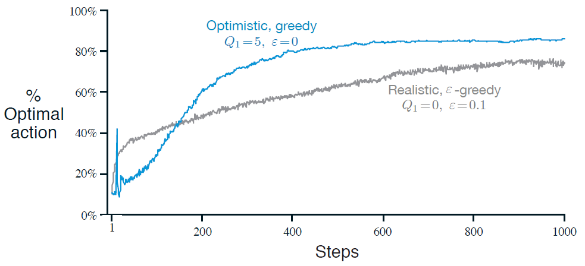

# 2.6 乐观初始值

<link href="../../../css/style.css" rel="stylesheet"></link>
我们至今讨论的所有方法或多或少依赖于初始的动作值的估计, $$Q_1(a)$$. 使用统计学的术语, 这些方法因初始的估计值产生了偏差. 对于样本平均方法来说, 当所有的动作都被选择了一次后偏差就消失了; 但对$$\alpha$$值恒定的方法来说, 这一偏差会永远存在, 但会随时间逐步减小, 如[(2.6)](to equation2.6)所示. 在实际应用中, 这类偏差常常并不成问题, 反而有时还很有帮助. 其负面影响是初始值实际上变成了一组必须由用户选择的参数, 要是能将它们都设为0该多好. 其正面影响是提供了一种简单的方式, 来应用关于预期的奖赏值的水平的先验知识.

初始动作值也可以以一种简单的鼓励探索的方式来使用. 如果我们在10-摇臂测试工具中, 不是将初始动作值都设为0, 而是将其都设为+5. 我们还记得在该问题中$$q_*(a)$$是从均值为0且方差为1的正态分布中采样得到的. 因此+5的初始估计值是极为乐观的. 但这份乐观鼓励了动作值方法去探索. 无论开始时选择了哪个动作, 收到的奖赏都低于初始估计值; 学习器因此对收到的奖赏感到"失望", 转而选择别的动作. 结果就是都在估计值收敛前被选择了数次. 即使一直选择贪心动作, 强化学习系统也做了大量的探索.

[图2.3](to figure2.3)展示了$$Q_1(a) = +5$$的贪心方法在10-摇臂测试工具上的表现. 作为对比, $$Q_1(a) = 0$$的$$\varepsilon$$-贪心方法也展示在了图中. 最开始, 乐观方法表现得比$$\varepsilon$$-贪心方法差, 但因为乐观方法的探索随时间流逝减少, 因此最终乐观方法的表现好于$$\varepsilon$$-贪心方法. 我们将这一鼓励探索的技术称为*乐观初始值*&lt;optimistic initial values&gt;. 我们将其视作一个在固定性问题上可以表现得非常高效的小技巧, 但其远不能成为一个通用的有效鼓励探索的方法. 例如, 其不适宜于非固定性问题, 因为其对探索的驱动本质上是暂时的. 如果任务变化并对探索产生了新的需求, 那么这一方法就无能为力了. 事实上, 以具体的任意方式关注于初始值的方法都对一般的非固定性问题都无能为力. 时间上的开端只会出现一次, 因此我们不应该对开端过分关注. 这一评判也适用于样本平均方法, 其也将时间上的开端作为特别事件, 并以均等的权重来平均所有的后续奖赏. 话虽如此, 所有这些方法都很简单, 且这些方法中的一个或多个的组合常常对实际应用而言足够了. 在本书的余下部分中我们将频繁使用这些简单的探索技术.

<b>图2.3</b>
乐观的动作值初始估计在10-摇臂测试工具上的表现. 两种方法都使用了恒定步长参数$$\alpha = 0.1$$

*练习 2.6: 神秘的尖峰*&nbsp; &nbsp; &nbsp; &nbsp;[图2.3](to figure2.3)中显示的结果应该是很可靠的, 因为其为2000个独立的、随机选择的10-摇臂赌博机问题上的结果的平均. 那么在乐观方法的曲线的开始部分为什么会有震荡与尖峰? 换句话说, 是什么使得这一方法在特定的较早时步中, 从平均的意义上说, 表现得特别好或特别差?$$\square$$

*练习 2.7: 无偏的恒定步长技巧*&nbsp; &nbsp; &nbsp; &nbsp;在本章的多数部分中我们使用了样本均值来估计动作值, 因为样本平均法不会产生如恒定步长方法所拥有的初始偏差(具体见导出[(2.6)](to equation2.6)的分析). 然而, 样本平均方法可能不是一个完全令人满意的解决方案, 因为其在非固定性问题上表现不佳. 有没有可能避免恒定步长带来的偏差又保持其在非固定性问题上的优势? 一种方法是使用如下步长
$$
\beta_n \doteq \alpha / \bar{o}_n,
\tag{2.8}
$$
来处理第某一动作带来的第$$n$$次的奖赏, 其中$$\alpha > 0$$, 是常规的恒定步长, 而$$\bar{o}_n$$为从0开始逐步靠近1的序列:
$$
\bar{o}_n = \bar{o}_{n - 1} + \alpha (1 - \bar{o}_{n - 1}), \; \text{对} n \geq 0 \text{, 且其中} \bar{o}_0 \doteq 0
\tag{2.9}
$$
做出如[(2.6)](to equation2.6)中的分析来证明$$Q_n$$是无初始偏差的指数新近衰减平均.$$\square$$