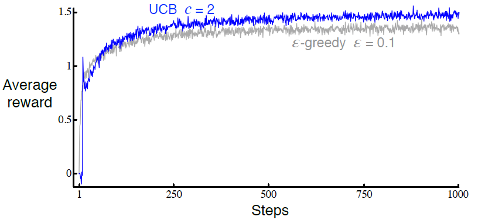

# 2.7 上置信界动作选择

<link href="../../../css/style.css" rel="stylesheet"></link>
因为对动作值估计的准确度的不确定性存在, 所以需要进行探索. 贪心动作是当前看上去最好的动作, 但其他动作中的一些事实上可能更好. $$\varepsilon$$-贪心动作选择强制使得非贪婪动作被选择, 但这一过程对各个动作是不加区分的, 即使是接近贪心或特别不确定的动作也不被偏好. 对非贪心动作来说, 将其估计值离成为最大值的距离与估计值中的不确定性考虑在内, 由此判断各个贪心动作成为最优动作的潜力, 然后根据这个潜力进行动作动作选择显然是更好的. 一种能做到这一点的、高效的方式就是由下式进行动作选择
$$
A_t \doteq \underset{a}{\operatorname{argmax}} \left[ Q_t(a) + c \sqrt{\frac{\ln t}{N_t(a)}} \right],
\tag{2.10}
$$
其中$$\ln t$$表示$$t$$的自然对数($$e \approx 2.71828$$的该数次幂等于$$t$$), $$N_t(a)$$表示在时间$$t$$之前动作$$a$$被选择的次数([(2.1)](to equation2.1)中的分母), 以及常数$$c > 0$$控制了探索的程度. 如果$$N_t(a) = 0$$, 那么$$a$$被认为是最优动作.

如上所述的*上置信界*&lt;upper confidence bound, UCB&gt;动作选择的观念为: 式中的根号项是对$$a$$的估计值的不确定度或方差. 欲寻求最大值的项[^1], 是动作$$a$$可能的真实值的上界的一种, 其中由$$c$$决定置信水平. 每当$$a$$被选择时, 不确定性可以被认定是减少了: $$N_t(a)$$增加, 因为其出现在分母中, 所以不确定性项减小了. 在另一方面, 每当除$$a$$之外的动作被选择, $$t$$增加而$$N_t(a)$$保持不变; 因为$$t$$出现在分子中, 所以对不确定性的估计增加了. 自然对数的使用意味着增长的速率逐渐变慢, 但其值依然会趋近于无穷大; 所有的动作都会被选择, 但有较低的估计值或已经被频繁选择过的动作, 将会随时间推移减少被选择的频率. 在10-摇臂测试工具上使用UCB的结果如[图2.4](to figure2.4)所示. 如图中所示, UCB常常表现得很好, 但相比于$$\varepsilon$$-贪心而言, 其更难从赌博机问题拓展到书中余下部分中的、更为一般的强化学习情形. 其中的一个困难之处就是对非固定性问题的处理; 需要比[第2.5节](to section2.5)中所呈现的更为复杂的方法来进行处理. 另一个困难之处在于对巨大状态空间的处理, 特别是当使用了如本书第2部分所述的函数近似方法时. 在这些更为复杂的情形下, UCB动作选择通常是不理想的. 

<b>图2.4:</b>
UCB动作选择在10-摇臂测试工具中的平均表现. 如图所示, 除了UCB从尚未尝试过的动作中随机进行选择的起始$$k$$步外, UCB通常表现得比$$\varepsilon$$-贪心动作选择好.

*练习 2.8: UCB尖峰*&nbsp; &nbsp; &nbsp; &nbsp;在[图2.4](to figure2.4)中UCB算法的表现在第11步时有一个明显的尖峰. 为什么会这样? 请注意, 为了使答案完全令人满意, 其需要从"为什么奖赏在第11步增加了", 以及"为什么奖赏又在后续的几步中减小了"这两个方面进行解释. 提示: 如果$$c = 1$$, 那么尖峰将更矮. $$\square$$

 
 
[^1]: 即$$\underset{a}{\operatorname{argmax}}$$右侧的量, 译者注