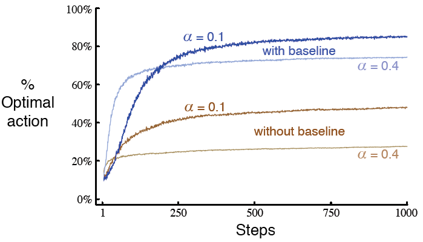

# 2.8 梯度赌博机算法

<link href="../../../css/style.css" rel="stylesheet"></link>
在本章的之前部分, 我们已经学习了对动作值进行估计, 然后使用估计值来选择动作的多种方法. 这常常是一种好的途径, 但并不是唯一的途径. 在本节中, 我们将考虑如何为每一个动作$$a$$学得各自实数型的*偏好*&lt;preference&gt;, 我们将其记为$$H_t(a)$$. 偏好值越高, 那么对应的动作越常被采用, 但是偏好不能使用奖赏的观念来理解. 只有一个动作相对于另一个动作的偏好值是有意义的; 如果我们将所有动作的偏好值加上1000, 各个动作被选择的概率仍然保持不变, 其中概率是由如下的*soft-max分布*(也称为Gibbs分布或Boltzmann分布)决定的:
$$
\mathrm{Pr}\{A_t = a\} \doteq \frac{e^{H_t(a)}}{\sum_{b = 1}^{k} e^{H_t(b)}} \doteq \pi_t(a),
\tag{2.11}
$$
其中我们引入一种实用的新标记$$\pi_t(a)$$, 来表示在时间$$t$$采取动作$$a$$的可能性. 起始时, 所有动作的偏好值都是相等的(即对所有的a来说, $$H_1(a) = 0$$), 因此所有动作都有相同的被选择的概率.

*练习 2.9*&nbsp; &nbsp; &nbsp; &nbsp;证明在只有两个动作的情况下, soft-max分布, 和统计学及人工神经网络中常用的logistic或sigmoid函数给出的分布是等价的.$$\square$$

基于随机梯度上升&lt;stochastic gradient ascent&gt;, 可以自然地得到这一设定下的学习算法. 在每一步时, 在选择动作$$A_t$$并收到奖赏$$R_t$$后, 动作偏好值使用下式进行更新:
$$
\begin{align}
H_{t + 1}(A_t) &\doteq H_t(A_t) + \alpha (R_t - \bar{R}_t)(1 - \pi_t(A_t)), &\text{且} \\
H_{t + 1}(a) &\doteq H_t(a) - \alpha(R_t - \bar{R}_t) \pi_t(a), &\text{对所有的}a \neq A_t,
\end{align}
\tag{2.12}
$$
其中$$\alpha > 0$$, 为步长参数, 且$$\bar{R}_t \in \mathbb{R}$$, 为时间$$t$$及之前所有奖赏的平均, 可以如[第2.4节](to section2.4)(如果问题是非固定性的话, 那么如[第2.5节](to section2.5))中所述的那样进行增量式的计算. $$\bar{R}_t$$这一项的是作为奖赏进行比较的基准线的. 如果奖赏高于基准线, 那么将来采取动作$$A_t$$的概率将增加; 反之如果奖赏低于基准线, 那么概率将减小. 而未被选择的动作朝相反方向移动.

[图2.5](to figure2.5)展示了梯度赌博机算法在10-摇臂测试工具的变体上的结果, 该变体中真实的期望奖赏是从一均值为+4而非0(方差和从前一样为1)的正态分布中采样获得的. 所有奖赏的同时增加对梯度赌博机算法绝对没有影响, 因为奖赏的基准线会立即适应到新的水平上. 但如果基准线被省略了(即如果[(2.12)](to equation2.12)中的$$\bar{R}_t$$恒取0), 那么其性能将如图中所示的急剧退化.

<b>图2.5</b>
在$$q_*(a)$$接近+4而非0的10-摇臂测试工具上, 有或者没有奖赏基准线的梯度赌博机算法的平均表现

<h4>作为随机梯度上升的梯度赌博机算法</h4>
<pre>
我们可以将梯度赌博机算法理解为梯度上升的随机近似, 来获得更深入的理解. 在典型的<i>梯度上升</i>中, 各个动作的偏好值$$H_t(a)$$将会正比于增量在表现上的效果而增加:
$$
H_{t + 1}(a) \doteq H_t(a) + \alpha \frac{\partial \mathbb{E}[R_t]}{\partial H_t(a)},
\tag{2.13}\label{2.13}
$$
其中表现的度量即为期望的奖赏:
$$
\mathbb{E}[R_t] = \sum_x \pi_t(x) q_*(x),
$$
且增量的效果的度量为: 表现的度量相对于动作偏好值的<i>偏导数</i>. 当然, 因为假设上我们不知道$$q_*(x)$$, 所以不可能在现有情况下实现典型的梯度上升, 但事实上算法<a href='#mjx-eqn-2.12'>(2.12)</a>的

</pre>

